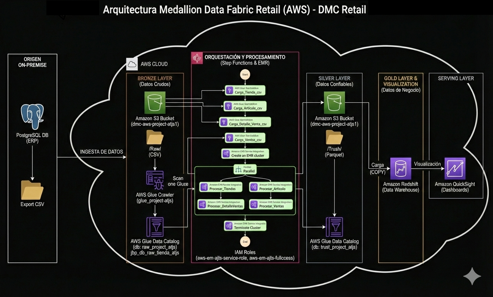
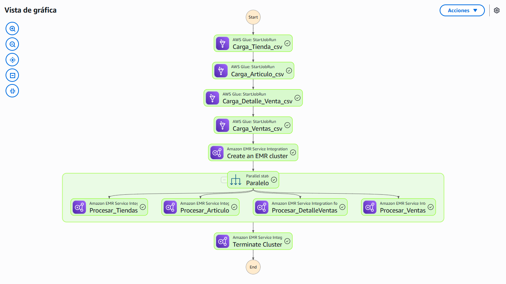

# Implementación en AWS para Análisis de Ventas Retail

Proyecto  para la implementación de una **arquitectura de Data Lake y Data Warehouse en AWS** que habilite análisis de ventas, gobernanza y toma de decisiones en **DMC Retail**. 

---

## Resumen ejecutivo y objetivos

**Resumen ejecutivo**  
DMC Retail requería consolidar datos transaccionales on‑premise para obtener reportes confiables y oportunos. La solución implementada centraliza ingesta, catalogación, procesamiento y consumo analítico en AWS, entregando un pipeline reproducible, auditable y escalable que soporta dashboards de negocio y reduce la latencia en la obtención de información.

**Objetivos principales**  
- **Negocio**: entregar KPIs confiables para la toma de decisiones y reducir el tiempo de generación de reportes.  
- **Técnico**: implementar ingesta automatizada, procesamiento escalable y almacenamiento optimizado.  
- **Operativo**: asegurar trazabilidad, gobernanza y operación con runbooks y monitoreo.

**Alcance**  
- Extracción desde PostgreSQL on‑premise hacia Amazon S3.  
- Catalogación con AWS Glue.  
- Procesamiento con AWS Glue / EMR y PySpark.  
- Carga analítica en Amazon Redshift.  
- Orquestación con AWS Step Functions.  
- Consumo mediante Power BI.

---

## Arquitectura y diagramas

La arquitectura se organiza en capas: **raw**, **trusted** y **analítica**, con control de versiones, lineage y orquestación centralizada. A continuación se presentan los diagramas principales del proyecto. Las imágenes están en la carpeta `Images` del repositorio.

**Nombre de la imagen**: **Arquitectura_DMC_Retail_aws**

<p align="center">
  
</p>

**Nombre de la imagen**: **Pipeline_StepFuction**

<p align="center">
  
</p>


---

## Plan de implementación por fases

**Fase 1 Preparación y aprovisionamiento**  
- Crear bucket S3 con prefijos `/raw`, `/trusted`, `/scripts`, `/logs`.  
- Definir roles IAM y políticas de least privilege.  
- Documentar placeholders de ARNs y parámetros de cuenta.  
**Entregable**: documento de configuración y lista de ARNs placeholder.

**Fase 2 Ingesta y catalogación**  
- Implementar `ingesta_postgres.py` para exportar tablas a S3.  
- Configurar Glue Crawler y validar esquemas.  
**Entregable**: logs de ingesta y entradas en catálogo.

**Fase 3 Procesamiento y transformación**  
- Desarrollar jobs PySpark (`transformacion_spark.py`, `transformacion_glue_*.py`).  
- Escribir datasets optimizados y particionados en `/trusted`.  
**Entregable**: datasets en formato columnar y scripts versionados.

**Fase 4 Carga analítica y consumo**  
- Crear DDL y cargas en Redshift (`queries_redshift.sql`).  
- Publicar dashboards en Power BI con KPIs validados por negocio.  
**Entregable**: tabla `reporte_ventas_tienda` y dashboard publicado.

**Fase 5 Orquestación y monitoreo**  
- Implementar Step Functions con reintentos, notificaciones y logs.  
- Configurar CloudWatch, alarmas y runbooks.  
**Entregable**: workflow operativo y documentación de operación.


## Validación pruebas y criterios de aceptación

**Pruebas por fase**  
- **Ingesta**: verificación de archivos en `/raw`, conteo de filas y checksum.  
- **Catalogación**: Glue refleja esquemas y particiones correctamente.  
- **Procesamiento**: validación de esquema, conteo de filas y pruebas de regresión.  
- **Carga**: reconciliación de agregados entre S3 y Redshift.  
- **Consumo**: dashboards muestran KPIs correctos y filtros funcionales.

**Criterios de aceptación**  
- Datasets en `/trusted` con esquema validado y particionado.  
- Tabla analítica en Redshift con conteos reconciliados y consultas de control.  
- Dashboard publicado y validado por stakeholders de negocio.  
- Runbook y métricas configuradas para operación continua.

---

### Seguridad gobernanza entrega y operación

**Seguridad**  
- Aplicación del principio **least privilege** en IAM.  
- Cifrado en reposo y en tránsito para S3 y Redshift.  
- Gestión de secretos con **AWS Secrets Manager**.  
- Auditoría con **CloudTrail** y logs centralizados en CloudWatch.

**Gobernanza**  
- Catalogación con Glue para lineage y descubrimiento.  
- Versionado de scripts y notebooks en Git.  
- Políticas de retención y ciclo de vida en S3 para optimizar costos.

**Entregables y checklist de entrega**  
- **Código fuente** y scripts en `src` y `SQL`.  
- **Notebooks** de validación en `Notebook_ETL`.  
- **Informe técnico** en `Docs`.  
- **Diagramas** en `Images`.  
- **Evidencias**: capturas de S3 `/raw` y `/trusted`, catálogo Glue, ejecución de jobs (SUCCEEDED), consultas de validación en Redshift y dashboard Power BI.  

**Checklist**  
- [ ] Informe final con anexos  
- [ ] Capturas S3 `/raw` y `/trusted`  
- [ ] Captura catálogo Glue con esquemas  
- [ ] Captura ejecución jobs con estado SUCCEEDED  
- [ ] Captura Redshift con consultas de validación  
- [ ] Captura dashboard Power BI  
- [ ] Paquete de código y scripts versionados

**Contacto y responsabilidad**  
**Responsable del proyecto**  
**Angel Teodoro Jaramillo Sulca**  
Data Engineer | BI Design Architect

---

## Estructura del repositorio

```
Proyecto_DataFabric_Store/
│── Docs/                 # Informe técnico y anexos
│── Images/               # Diagramas y arquitectura
│   ├── Arquitectura_DMC_Retail_aws.png
│   ├── Pipeline_StepFuction.png
│   ├── Datawarehouse_Tech.png
│   └── Reporte.png
│── Notebook_ETL/         # Notebooks de ingesta y transformación
│── SQL/                  # Scripts SQL para Redshift
│── src/                  # Scripts ETL en Python
│── requirements.txt      # Dependencias del proyecto
│── .gitignore            # Archivos ignorados en Git
│── README.md             # Este archivo
```

---
